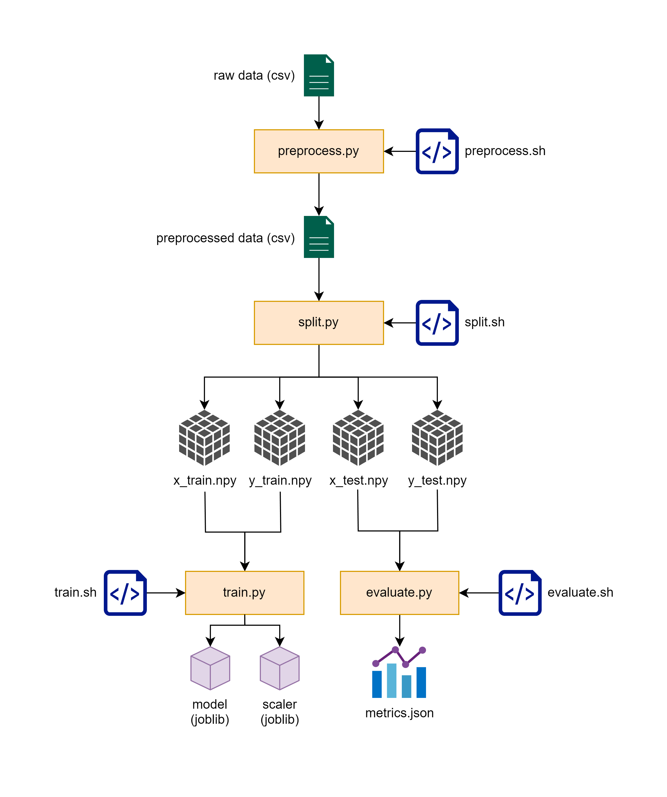
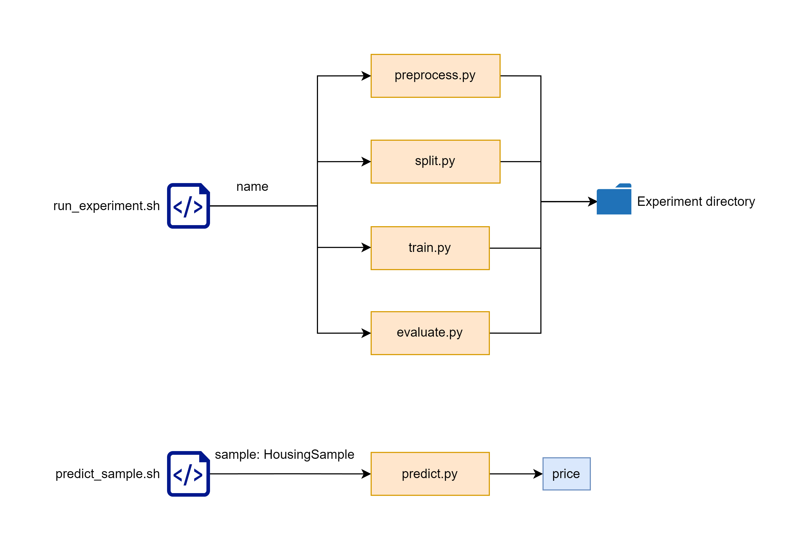
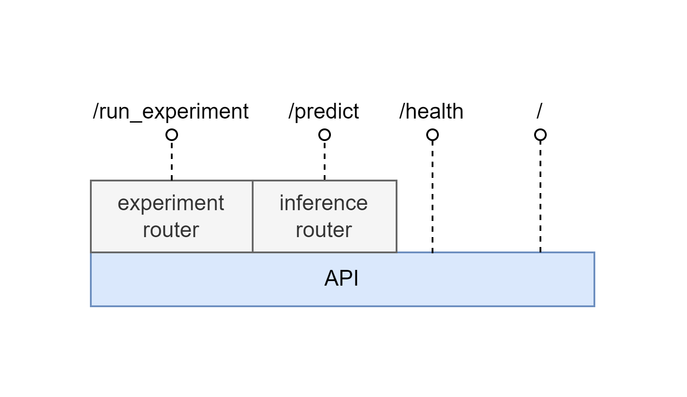

# House Price Prediction Service

## Datasets
- As the dataset for this task wasn't specified, I've chosen the commnly used California Housing Prices dataset
- Description of the dataset can be found here: https://www.kaggle.com/datasets/camnugent/california-housing-prices/code
- Despide it being not a good practice, given the small size of the dataset, it is commited to the repository and can be found in the `./data` directory
- I have also considered the dataset House Prices in Poland (https://www.kaggle.com/datasets/dawidcegielski/house-prices-in-poland), however the linear regression did not yield good initial results

## Experimentation 
- All initial experimentation, visualization and analysis of the aforementioned datasets can be found in `./notebooks` folder

## Architecture and design
- According to the requirements, I have distinguished 2 main workflows:
    - running experiments given possible changes in data and model architecture
    - running inference

### Experiments
- An experiment consists of 4 phases:
    - Preprocessing `./src/preprocess.py` 
        - container basic data cleanup and feature engineering
        - input artifact is the raw dataset (csv)
        - output artifact is the preprocessed dataset (csv)
    - Spliting `./scr/split.py`: 
        - split the preprocessed dataset into train and test sets and prepares the data for training
        - input artifact is the preprocessed dataset (csv)
        - output artifact are numpy files (npy): `x_train`, `y_train`, `x_test` and `y_test`
    - Training `./src/train.py`:
        - normilizes the training data and trains a linear regression model using scikit-learn
        - input artifacts are `x_train.npy` and `y_train.npy`
        - output artifacts are the model `linear_regression_model.joblib` and scaler `scaler.joblib`
    - Evaluation `./scr/evaluate.py`:
        - evaluates the train model using the root mean squared error (RMSE) and coefficient of determination (R2)
        - input artifacts are `x_test.npy`, `y_test.npy`, trained model `linear_regression_model.joblib` and fit scaler `scaler.joblib`
        - output artifacts are the metrics `metrics.json`

    

    

### Inference
- Inference is performed in the `predict.py`. Expected input features are:
    - `--experiment` : Experiment name to determine, which model to use. (optional - if omitted, the default model in the `/model` directory will be used)
    - `--latitude` : Latitude of the house.
    - `--longitude` : Longitude of the house.
    - `--housing_median_age` : Median age of a house within a block; a lower number is a newer building.
    - `--total_rooms` : Total number of rooms within a block.
    - `--total_bedrooms` : Total number of bedrooms within a block.
    - `--population` : Total number of people residing within a block.
    - `--households` : Total number of households, a group of people residing within a home unit, for a block.
    - `--median_income` : Median income for households within a block of houses (measured in tens of thousands of US Dollars).
    - `--ocean_proximity` : Location of the house w.r.t ocean/sea. ('<1H OCEAN', 'INLAND', 'ISLAND', 'NEAR BAY', 'NEAR OCEAN')
- The model outputs:
    - `medianHouseValue` - Median house value for households within a block (measured in US Dollars)

### API 
- To simplify the usage of these script, I added an API that can be access via the browsers and both workflows can be executed from there.
    


### Quick start
- Using docker, you can spin up the container to ensure compatibility:
    - run `restart_container_windows.bat` or `restart_container.sh` depending on your OS
    - ensure container is running:
        - `http://localhost:4000/`
        - `docker logs docker logs house-price-predictor`
    
- Without docker
    - you can still run experiments with scripts in the `./scripts` and `./scripts/examples` directories. Choose the `.sh` or `.bat` depending on your OS
    - API is not accessible
    - Ensure that your environment is setup correctly and install dependencies specified in `./requirements.txt`
    - Ensure that command `python` exists (as opposed to `python2` or `python3`) or create an alias
    
- Run experiments:
    - run `./scripts/run_experiment.sh [name] --force --clean` or `./scripts/run_experiment_windows.bat <name> -Force -Clean`
        - `--force` / `-Force` overrides experiment with name [name] if it already exists
        - `--clean` / `-Clean` removed intermediate artifacts (preprocessed csv data and split numpy files)
    - or directly with python:
        - `python ./src/preprocess.py --input_data_path [path/to/raw.csv] --output_data_path [path/to/preprocessed.csv]`
        - `python ./src/split.py --input_data_path [path/to/preprocessed.csv] --output_directory [experiment-dir] --test-size [test-size]`
        - `python ./src/train.py --train_data_directory [experiment-dir] --output_directory [experiment-dir]`
        - `python ./src/evaluate.py --test_data_directory [experiment-dir] --model_directory [experiment-dir] --output_directory [experiment-dir]`


- Run inference:
    - run `./scripts/examples/predict_sample.bat` or `./scripts/examples/predict_sample.sh` depending on your OS (the script needs to be modified in order to change the sample)
    - or run the prediction directly with python:
        ```
        python ./src/predict.py \
            --experiment [EXPERIMENT_NAME] \
            --longitude [LONGITUDE] \
            --latitude [LATITUDE] \
            --housing_median_age [HOUSING_MEDIAN_AGE] \
            --total_rooms [TOTAL_ROOMS] \
            --total_bedrooms [TOTAL_BEDROOMS] \
            --population [POPULATION] \
            --households [HOUSEHOLDS] \
            --median_income [MEDIAN_INCOME] \
            --ocean_proximity [OCEAN_PROXIMITY]
        ```


- Experiments and inference via API: 
    - visit `http://localhost:4000/docs` for documentation or use `curl` or `postman`
    - experiment endpoint: `http://localhost:4000/run_experiment`
    - prediction endpoint: `http://localhost:4000/predict` 

</br>

## Sample Prediction payloads: 
```
{
  "sample": {
    "households": 272,
    "housing_median_age": 44,
    "latitude": -122.22,
    "longitude": 37.79,
    "median_income": 3.5156,
    "ocean_proximity": "NEAR BAY",
    "population": 961,
    "total_bedrooms": 314,
    "total_rooms": 1487
  }
}
```

```
{
  "experiment_name": "my_experiment",
  "sample": {
    "households": 272,
    "housing_median_age": 44,
    "latitude": -122.22,
    "longitude": 37.79,
    "median_income": 3.5156,
    "ocean_proximity": "NEAR BAY",
    "population": 961,
    "total_bedrooms": 314,
    "total_rooms": 1487
  }
}
```